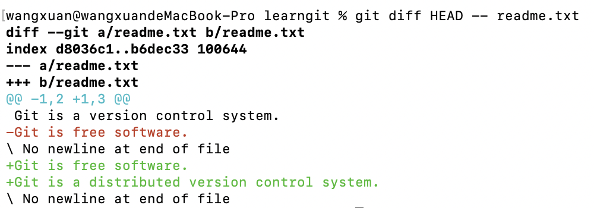

# 实验六报告

> 191220116 王璇

## 展示

 git diff, git log, git status 提交操作前后的区别

HEAD指向的版本就是当前版本，因此，Git允许我们在版本的历史之间穿梭，使用命令git reset --hard commit_id。
穿梭前，用git log可以查看提交历史，以便确定要回退到哪个版本。

## 遇到困难

问题：failed to push some refs to

解决方案：git push -u origin main

参考资料：https://stackoverflow.com/questions/24114676/git-error-failed-to-push-some-refs-to-remote

## 思考题

### 使用git的好处？

1. 便于协同开发，即便于管理一个项目的多个版本及其修改记录的多版本开发、便于多人合作开发同一个项目、便于在不同设备上持续开发同一个项目，强调个体。

2. 速度快、灵活。即跟集中式版本控制系统SVN做对比，无论是在克隆clone代码还是切换分支、提交修改，这些步骤无论从逻辑机制和速度来说都有了极大的提高，为我们节省了不少宝贵的时间，而不需要SVN漫长的等待。

3. 公共服务器压力和数据量都不会太大。开发者可以提交到本地，每个开发者通过克隆（git clone），在本地机器上拷贝一个完整的Git仓库。

4. 任意两个开发者之间可以很容易的解决冲突。

5. 便于离线工作。

### 使用远程仓库 (如 github/gitee 等)的好处？

便于协同开发。作为一个分布式的版本控制系统，在Git中并不存在主库这样的概念，每一份复制出的库都可以独立使用，任何两个库之间的不一致之处都可以进行合并.用GitHub来举例，GitHub可以托管各种git库，并提供一个web界面，从另外一个项目进行分支的非常简易，为项目贡献代码也非常简单。

### 在开发中使用分支的好处？你在实际开发中有哪些体会和经验？

#### 使用分支的好处：

版本迭代更加清晰；

开发效率提升；

利于代码review的实现，从而使整个团队开发更加规范，减少bug率。

#### 我的体会和经验：

如果大家都在一个分支上开发，就会把大量时间花在解决冲突上，非常影响开发团队内部人员各自的开发；当有人优化自己负责的代码时，也可以通过分支进行独立的处理，不会影响到他人对完整代码的使用从而影响开发效率。

